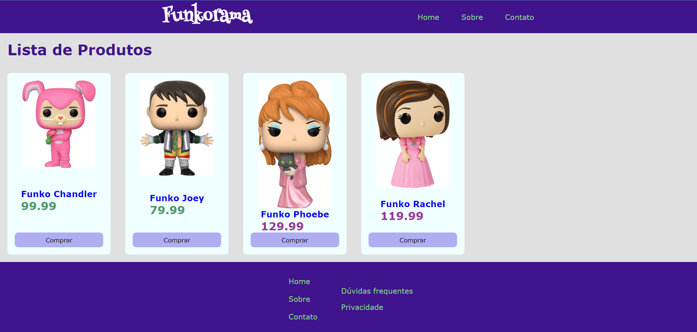

# Exercícios diretivas

Exercícios propostos para o assunto de diretivas do Angular. 

## Localização das respostas

Exercício 1) Utilizei as diretivas para alterar a cor do H1 na Page Home. (Pages>directives>purple.directive.ts)
Utilizei as diretivas para alterar a cor do H2 que acolhe os preços do componente cards dos produtos. (Shared>directives>blue.directive.ts)

Exercício 2), 3) e 4) Todos estão no Componente Cards.

## Autor

<a href="https://github.com/leomonadas">
 
  
 <b>Leonardo Alves</b></a> 

 

  
  
    
  

